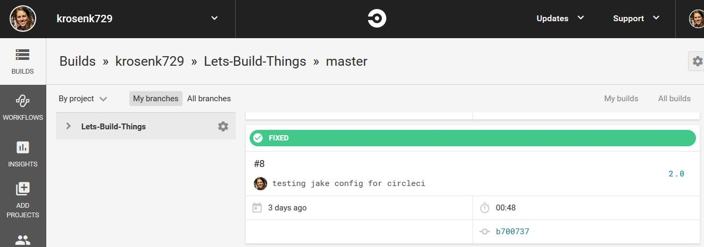

# Automated, Reproducible Build

### Like Legos For Code.

But legos that automatically build themselves continuously 

This code auto-builds using CircleCI 

Try The Code on Your Conputer
------

1. Install [Git](http://git-scm.com/downloads)
1. Install [Node.js](https://nodejs.org/en/) to have Node and npm set up
1. Clone the latest code `git clone https://github.com/krosenk729/Lets-Build-Things.git`
1. Navigate to the project root using `cd Lets-Build-Things`
1. Delete the `.git` directory so you start fresh if you choose to later commit the repo
1. Type `npm install` to install the latest code dependencies 
1. Run `node build.js` 

Building and Testing
--------------------

To build (and test):

1. Install jake `npm install -g jake` globally 
1. Run `jake` in command line or `node_modules/.bin/jake`

Who What Where Why?
------

Thanks to help from: 

+ Jake http://jakejs.com/docs
+ JSTest http://jstest.jcoglan.com/
+ Jest https://facebook.github.io/jest/docs/en/getting-started.html
+ CircleCI https://circleci.com/

+ http://blog.npmjs.org/post/127671403050/testing-and-deploying-with-ordered-npm-run-scripts
+ https://www.codeschool.com/screencasts/let-s-code-javascript-the-automated-build 
+ https://github.com/jamesshore/lets_code_javascript/
+ https://github.com/jamesshore/automatopia